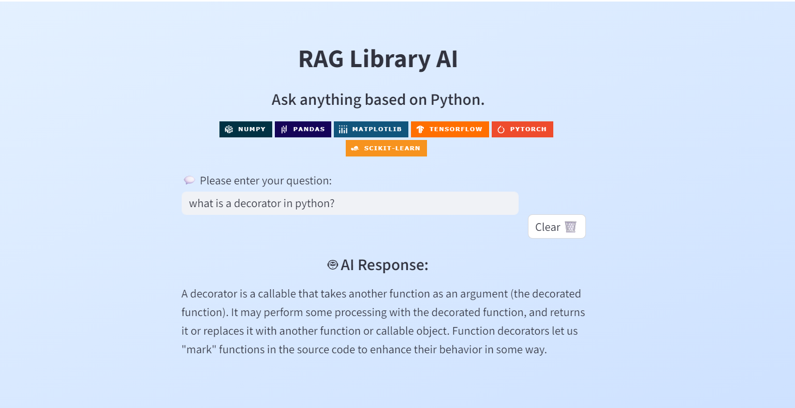
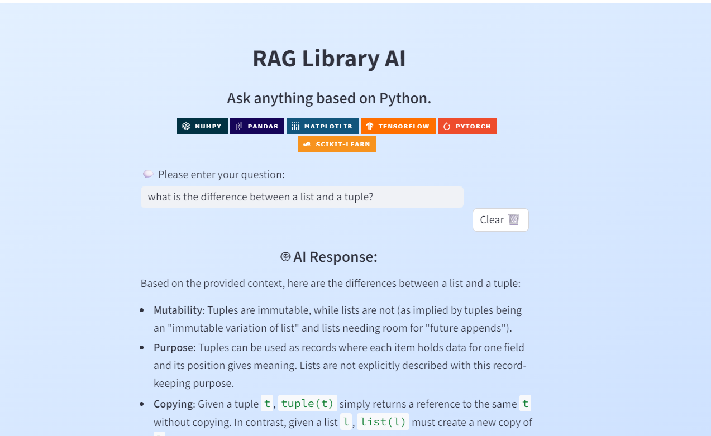

# RAG Library AI 📚


This project is a Retrieval-Augmented Generation (RAG) application designed to act as an intelligent librarian. By indexing technical Python books, it allows users to ask complex questions and receive answers grounded in the specific text of those books, complete with context.

---

# 📸 Screenshots
- Screenshots of the RAG Library in action
- Example questions



---

# 🚀 How It Works
The application follows a standard RAG pipeline:
- Ingestion: PDF books are loaded from the data/books/ directory.  
- Chunking: Documents are split into 1000-character segments with a 150-character overlap to maintain context.  
- Vectorization: Text chunks are converted into numerical embeddings and stored in a local ChromaDB instance.  
- Retrieval: When a user asks a question, the system searches the database for the most relevant text chunks.  
- Generation: The retrieved chunks and the user's question are sent to Gemini 2.5 Flash to generate a precise, grounded answer.

---

# 📖 Example Queries
- "What is the difference between a list and a tuple in Python?"

- "Explain what a decorator is in Python?"

---

# 📂 Project Structure
```
├── data/
│   └── books/              # PDF source files
├── vectorstore/
│   └── db/                 # Local ChromaDB persistent storage
├── app.py                  # Main Streamlit UI
├── ingest.py               # Script to process and embed PDFs
├── query.py                # CLI tool for testing queries
├── requirements.txt        # Python dependencies
├── pyproject.toml          # Project metadata and dependencies
├── .env                    # API Keys
└── .gitignore              # Files excluded from version control
```

---

# 💻 Getting Started 

## Clone the Repo
```Bash
git clone <https://github.com/reory/Rag_Library_AI.git>
cd rag-library-ai
```
## Setup Environment
Create a .env file in the root directory and add your Google API Key:
```.env
GOOGLE_API_KEY=your_actual_key_here
```
## Install Dependencies
```Bash
uv add -r requirements.txt
```
## Ingest Data
Place your PDFs in data/books/ and run the ingestion script to build the vector database:
```Bash
uv python ingest.py
```
## Run the App
```Bash
uv run streamlit run app.py
```

---

# ⚒️ Tech Stack: 
- Python 3.10+  
- Frontend: Streamlit  
- Orchestration: LangChain  
- LLM: Google Gemini 2.5 Flash  
- Vector Database: ChromaDB  
- Embeddings: Sentence-Transformers

---

# 🛣️ Roadmap Features
- [ ] Rust-Powered Processing: Integrate a high-speed text chunking core using PyO3      and Maturin for lightning-fast book ingestion.
- [ ] Display exactly which page and book the AI found the answer in.
- [ ] Multi-User Sessions: Support individual chat histories.
- [ ] Hybrid Search: Combine vector search with keyword search for better accuracy.
- [ ] UI Overhaul: Add a dark mode toggle and PDF previewer in the sidebar.
- [ ] Integrate a Python REPL (Read-Eval-Print Loop) using LangChain's PythonREPLTool.

---

# 📝 Notes
- Embedding Model: Currently using sentence-transformers/all-MiniLM-L6-v2. 
If you change this, you must delete the vectorstore/db/ folder and re-run ingest.py.
- Gemini Version: The project is pinned to gemini-2.5-flash for high-speed, low-latency responses.
- Chunking: If the AI struggles with detailed technical code blocks, consider reducing the chunk size or increasing the overlap in ingest.py

---

Built by Roy Peters 😁
[](https://linkedin.com/in/roy-p-74980b382/)
