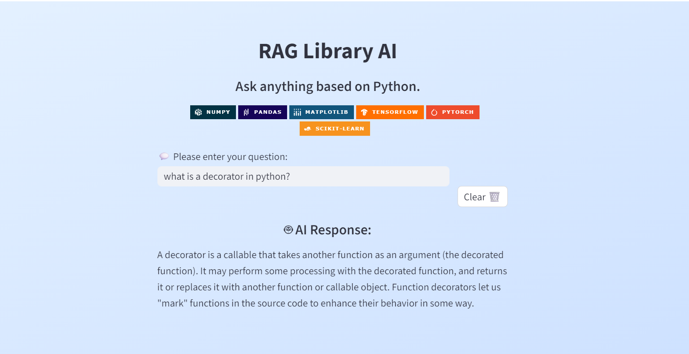
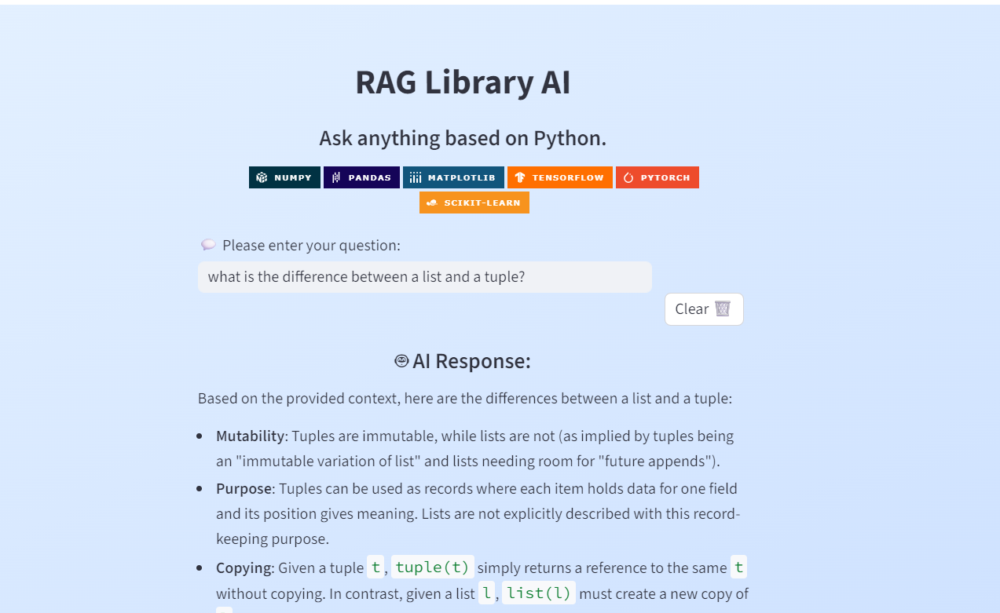

# 🏡 Rag-Library-AI


An ultra-fast, hallucination-resistant Retrieval-Augmented Generation (RAG) system built to query technical documentation. This project uses a custom high-speed text chunker written in Rust (via PyO3) for parsing, ChromaDB for vector storage, Gemini 2.5 Flash as the reasoning core, and a mathematical Semantic Guardrail Filter to completely intercept and block AI hallucinations.

---

## 📸 Screenshots

UI of the Rag Library Dashboard



---

## 🚀 Key Features
- Dual Interfaces: Interaction via a clean Streamlit Web Dashboard `(app.py)` or a lightweight CLI Tool `(query.py)`.

- Rust-Powered Performance: Document ingestion uses a custom high-speed text splitting package `(fast_chunker)` built with `Rust` and exposed to `Python` using `PyO3`.

- Semantic Guardrails: Every response undergoes a real-time Groundedness Audit using local embeddings (all-MiniLM-L6-v2) and Cosine Similarity to evaluate if the AI's response is mathematically justified by the source texts.

- Deterministic Safety Fallbacks: Completely blocks hallucinated library syntax or jumbled text blocks, gracefully bypassing checks only when the AI correctly identifies a lack of context.

---

## 📁 Project Structure
The project architecture is structured for scalability, featuring isolated scanning, processing, and documentation assembly engines.

```python
rag-technical-app/
├── fast_chunker/          # Custom Rust text splitting module
│   ├── src/
│   │   └── lib.rs         # PyO3 Rust chunking implementation
│   ├── Cargo.toml         # Rust dependency definitions
│   └── pyproject.toml     # Rust build & metadata configuration
├── vectorstore/
│   └── db/                # Persistent ChromaDB vector storage files
├── screenshots/           # Screenshots of the Rag App
├── app.py                 # Core Streamlit Web Application interface
├── query.py               # Command-line (CLI) interaction utility
├── ingest.py              # PDF Parsing and Vector Store Ingestion engine
├── guardrail.py           # Semantic Guardrail verification system
├── requirements.txt       # Python environment dependencies
├── tests/                 # Pytest suite
└── .gitignore             # Git exclusion parameters  
```

---

## 🚀 Getting Started
Prerequisites
Python 3.11 or higher

A Google Gemini API Key (obtained via Google AI Studio)

### Installation & Environment Setup
Clone the repository and move into your project root:

```Bash
git clone <https://github.com/reory/rag_library_ai>
cd rag-technical-app
```
### Create and activate a virtual environment:

```Bash
# Windows
python -m venv venv
venv\Scripts\activate

# macOS / Linux
python3 -m venv venv
source venv/bin/activate
```
### Install the project dependencies. 
This automatically installs the specialized, pre-compiled fast_chunker Linux/Windows target wheel along with core frameworks:

```Bash
uv pip install -r requirements.txt
```
### Environment Variables Configuration
- Create a .env file in the root directory to store your API credentials locally:

### Code snippet
- GOOGLE_API_KEY=your_actual_gemini_api_key_here

### Ingesting Documents
Run the ingestion pipeline to compile the high-speed Rust chunks into your persistent vector store:

```Bash
python ingest.py
```

---

## 💻 Usage
- Web Interface (Streamlit Dashboard)
Launch the responsive, styled dashboard interface locally:

```Bash
python -m streamlit run app.py
```
- Open http://localhost:8501 in your browser.

The UI features styled badge elements for core Python libraries, interactive querying, a quick history clear utility, and full audit logs mapping your Guardrail Verification parameters.

---

## 🛡️ How the Hallucination Guardrail Works
- Every response undergoes a real-time verification pipeline before reaching the interface:

- Extraction & Generation: The system retrieves the top 3 document chunks and prompts Gemini 2.5 Flash to answer using only that context.

- Semantic Auditing: A local SentenceTransformer maps both the raw context and the AI's response into dense vector arrays.

- Similarity Check: A Cosine Similarity calculation evaluates factual alignment. If the score drops below 0.62, the response is immediately blocked.

- Safe Refusal Pass: Standard phrases admitting a lack of context (e.g., "The answer isn't in the context") bypass the math filter with a perfect 1.0 score.

### ⚙️ Parameter Tuning
Adjust the strictness of the filter inside guardrail.py:
```python
class RAGGuardrail:
    def __init__(self, threshold=0.60):
``` 
- Drop to 0.55 if blocking valid text; raise to 0.65+ if hallucinations slip through 😊

---

## 🛣️ Roadmap Features

- [x] High-speed Rust text chunking integration (`fast_chunker`).
- [x] Core Streamlit Web UI and CLI query processing pipelines.
- [x] Mathematical Semantic Guardrail Filter (Cosine Similarity Verification).
- [ ] **Self-Correction Loop:** Automatically re-prompt Gemini to fix answers if the guardrail filter detects a hallucination.
- [ ] **Conversational Memory:** Store message history in Streamlit session state to support continuous multi-turn chat dialogues.
- [ ] **Source Citation:** Extract and display document metadata (Book Title, Page Numbers) immediately below verified answers.
- [ ] **Semantic Input Routing:** Block or redirect out-of-scope user prompts upstream before triggering database or LLM resources.

---

* **Built by Roy Peters** 🙂
[](https://www.linkedin.com/in/roy-p-74980b382/)